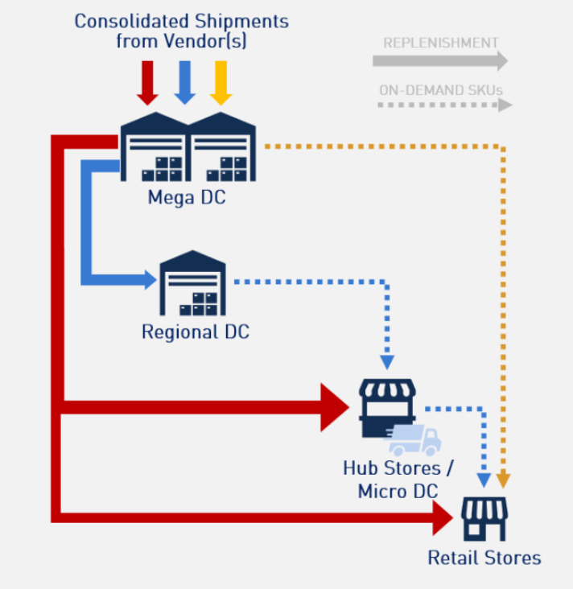

## **Inventory Network Management Roadmap**

### **Business Background**

A rapidly growing regional beverage company is experiencing significant supply chain bottlenecks. Last year, they operated **one central distribution facility** in Sai Gon that served for itself and **three major regional demand hubs**: Hanoi, Da Nang, and Can Tho.

Due to a recent surge in demand, the current network is facing skyrocketing distribution costs, frequent stockouts, and inefficient transport utilization.

 

The company is opening **multiple Regional Distribution Centers** in each region. Different warehouses face different capacity constraints, inbound/outbound pressure, and inventory risk. 

One recurring issue is that customer orders are sometimes fulfilled by warehouses outside the customer’s region, referred to as cross orders. This typically occurs when inventory is not well positioned in the local region, when available stock is too low, or when inbound supply arrives too close to the demand date. While cross-order fulfillment can reduce immediate lost sales, it may also increase shipping cost, delivery time, and operational complexity. As a result, the business wants to design a inventory management framework (with transfer decision) that not only minimizes out-of-stock risk, but also improves regional inventory positioning and reduces unnecessary cross-order fulfillment.

Inventory transfer may help reduce OOS risk, but it can also create trade-offs in cross-order rate, cost, and operational complexity.

As the network grows, the complexity grows. CEO is considering having **an Inventory Management Framework** (for mega and regional DC level) to optimize the network, reduce lead times, and minimize total logistics costs.

### **Technical Situation:**

Recently, Network Management Team received the request to build some dashboards to monitor the inventory performance:

1. Capacity Planning Dashboard  
2. Inventory Storage Dashboard  
3. Inventory Allocation Model Result  
4. Cross-order Dashboard

Current basic data in each Dashboard

| **Warehouse capacity**                                                                                                                                                                                         | **Inventory Storage**                                                                                                                                                                      |
| ----------------------------------------------------------------------------------------------------------------------------------------------------------------------------------------------------------- | ------------------------------------------------------------------------------------------------------------------------------------------------------------------------------------------- |
| **By datetime, by WH:**  - Warehouse total capacity (CBM / qty) - Used capacity - Utilization % - Inbound planned next 7 days - Outbound planned next 7 days - Storage type / size profile | **By SKU-WH:** - Available stock on-hand - Inbound ETA - Outbound forecast / sales forecast - Days of cover (DoC) - Safety stock by DoC - Last-14/30 days sales rate      |
|**Stock Transfer plan (by Inventory Allocation Model)**  | **Cross-order performance**             |
| - Source WH - Destination WH - Transfer lead time - Transfer qty by SKU - Move-transfer capacity                                    |- Cross-order rate - Units fulfilled by cross-WH and by best-WH - Low stock incidence - Late/or low inbound qty - Late/or low move-transfer qty |

However, the team doesn't know which metrics should be recommended, what workflow / decision logic they should propose for this **Inventory Management Framework**? 

You are hired to help the team to solve this problem.

## **Key Tasks**

### **Task 1: Design a sample data schema**
* Propose a data structure that connects all topics across the roadmap.

### **Task 2: Propose core metrics to track for**
* Capacity Planning  
* Inventory Storage Health   
* Inventory Model  
* Cross-order Dashboard

### **Task 3: Analytic Process**
* Recommend the workflow for transfer decision-making, including how to identify where stock risk exists to trigger the Inventory Allocation Model, then evaluate whether those actions actually improved regional stock positioning and reduced reliance on fulfillment from other regions.

### **Task 4: Implementation Roadmap**
* Outline the roadmap to develop these Dashboard and Model to successfully transition the inventory network management.
